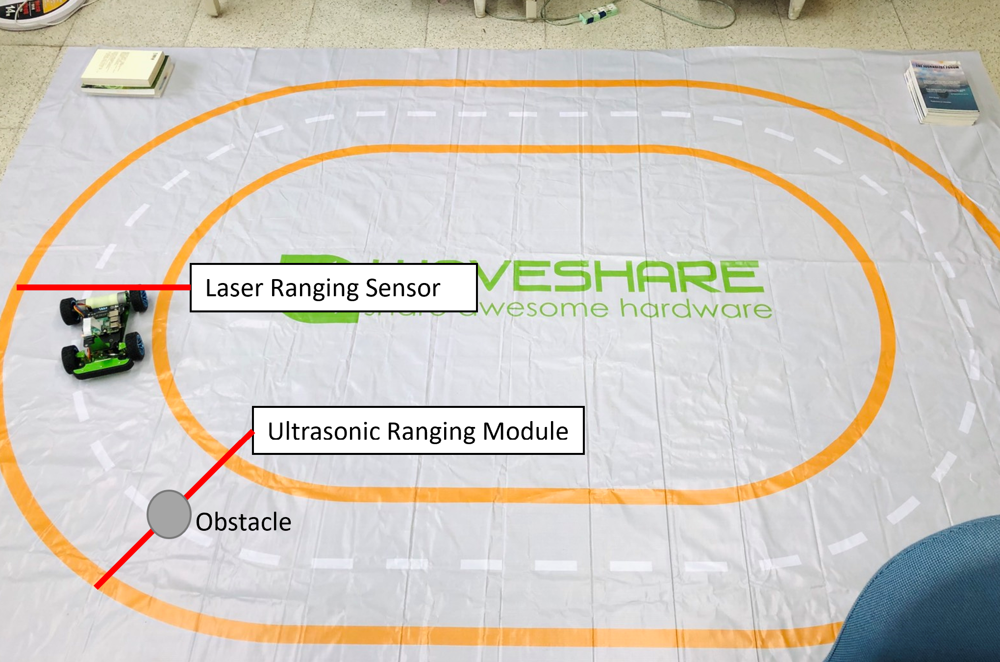

# Obstacle Detection System

## Motivation

Self-driving car usually reacts faster than human when encountering unexpected event. However, self-driving car is not perfect, faults and blind spots still might occur. Furthermore, for some road situations such as blind corner, it will be risky to solely rely on self-driving system. Road-side devices can provide useful information to both human-driving cars and self-driving cars. As an essential part of smart city, road-side devices that can detect and notify road events and conditions should be prevelant in the near future. Therefore, I decided to build an simple obstacle detection system in this project; its basic concepts might be useful in the future.

## Methods

This project is composed of a development board, a self-driving car, and an ultrasonic ranging module. In real world, it is too costly to put development boards on road-side, and the sensor might not be suitable for real roads. Self-driving car and development board are both connected to same Wi-Fi network. The propose of this project is to test out different combinations and validate ideas only.

### Hardware

The overall hardware arrangement is shown as the image below.

* STMicroelectronics STM32L4 Discovery Kit IoT Node (B-L475E-IOT01A)[^1]
    * Laser ToF and gesture detection system (VL53L0X, onboard)
    * Ultrasonic ranging module (HC-SR04)
* PiRacer AI Kit
    * Raspberry Pi 4 Model B
    * Canvas circuit
    * The car can drive around the circuit automatically

[^1]: In this document, STM32 refers to this device.

### Software

* STM32
    * Send socket when car passed checkpoint.
    * Socket contains obstacle and car information.
    * Assume car passed obstacle successfully after it goes into obstacle warning area for 5 or 10 seconds.

* Raspberry Pi
    * `isCar & isObstacle`: Manual mode
    * `isCar & ~isObstacle`: Auto mode
    * `~isCar`: Auto mode

## Results

The obstacle detection system has been built up successfully. Since I am still unfamiliar with donkey car, this system cannot change driving mode or throttle settings while the car is running; it can only stop current driving process and start a new driving process which has different settings.

### Usage

#### STM32 Settings

1. For proper EventQueue handling, go to `mbed-os/platform/mbed-lib.json` and change the value of `callback-nontrivial` to `false`.

2. (Optional) To make console print out floating point numbers, go to `mbed-os/targets/targets.json` and change the value of `printf_lib` to `std`.

3. Edit `mbed_app.json` to include the correct SSID and password.

4. Set `SocketAddress addr("IP",port)` in `main.cpp`.

#### Raspberry Pi Settings

1. Setup Wi-Fi connection. The username of Raspberry Pi is `pi`, and the password is `eslab305`.

2. `cd mycar`.

3. Set `HOST` and `PORT` in `server.py`.

4. Put all files in [RPi](RPi/) directory to this directory (`mycar`).

#### Run Program

* Testing Mode
    1. On Raspberry Pi, run `server_test.py` using command `python server_test.py`.
    2. Reset STM32.
    3. Raspberry Pi's console will show expected driving mode under different car-obstacle situations.
* Auto Driving Mode  
    1. On Raspberry Pi, run `server.py` using command `python server.py`.
    2. Reset STM32.
    3. The car will stop and start new driving process if it should.

### Demo Videos

Please refer to [server_test.mp4](Reports/server_test.mp4) and [server.mp4](Reports/server.mp4).

## Discussion

* Ultrasonic ranging module is quite stable.

* Laser ranging sensor needs tuning

* The workaround of being unable to control drive mode directly had no success.

* For STM32, all functions are in `main.cpp`; 

## Future Work

* Try other sensing method; the scanning angle of current method is small.

* Determine whether the car passed obstacle detection area or not, instead of just waiting for 5 or 10 seconds.

* Allow multiple cars to be on road.

* Active obstacle information receiving mode: car request obstacle information actively when it goes into obstacle warning area.

## References

1. [PiRacer AI Kit 组装教程](https://www.waveshare.net/wiki/PiRacer_AI_Kit_%E7%BB%84%E8%A3%85%E6%95%99%E7%A8%8B)

2. [GitHub: 2020-GRD-cultivator](https://github.com/NTUEE-ESLab/2020-GRD-cultivator)

3. [How to terminate a subprocess in Python](https://www.kite.com/python/answers/how-to-terminate-a-subprocess-in-python)